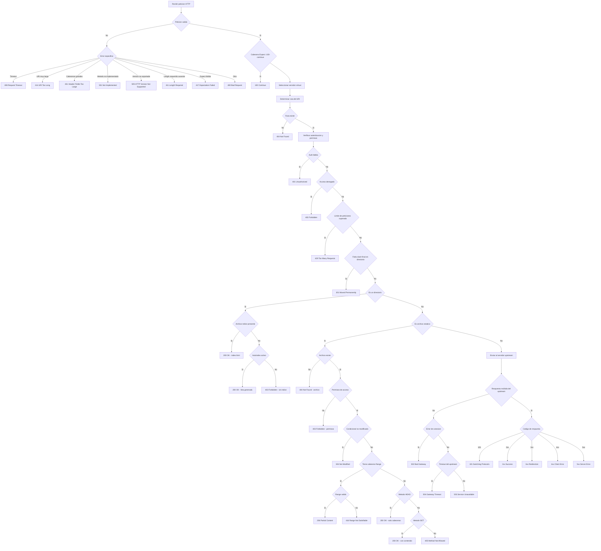

```mermaid
flowchart TD
    A[Recibir peticion HTTP] --> B{Peticion valida}
    B -- No --> B1{Error especifico}
    B1 -->|Timeout| E408[408 Request Timeout]
    B1 -->|URI muy larga| E414[414 URI Too Long]
    B1 -->|Cabeceras grandes| E431[431 Header Fields Too Large]
    B1 -->|Metodo no implementado| E501[501 Not Implemented]
    B1 -->|Version no soportada| E505[505 HTTP Version Not Supported]
    B1 -->|Length requerido ausente| E411[411 Length Required]
    B1 -->|Expect fallida| E417[417 Expectation Failed]
    B1 -->|Otro| E400[400 Bad Request]

    B -- Si --> C{Cabecera Expect: 100-continue}
    C -- Si --> C1[100 Continue]
    C --> D[Seleccionar servidor virtual]
    D --> E[Determinar ruta del URI]
    E --> F{Ruta existe}
    F -- No --> E404[404 Not Found]
    F -- Si --> G[Verificar autenticacion y permisos]

    G --> H1{Auth fallida}
    H1 -- Si --> E401[401 Unauthorized]
    H1 -- No --> H2{Acceso denegado}
    H2 -- Si --> E403[403 Forbidden]
    H2 -- No --> H3{Limite de peticiones superado}
    H3 -- Si --> E429[429 Too Many Requests]
    H3 -- No --> I{Falta slash final en directorio}
    I -- Si --> E301[301 Moved Permanently]
    I -- No --> J{Es un directorio}

    J -- Si --> K{Archivo indice presente}
    K -- Si --> L[200 OK - index.html]
    K -- No --> M{Autoindex activo}
    M -- Si --> L2[200 OK - lista generada]
    M -- No --> E403b[403 Forbidden - sin indice]

    J -- No --> N{Es archivo estatico}
    N -- Si --> O{Archivo existe}
    O -- No --> E404b[404 Not Found - archivo]
    O -- Si --> P{Permisos de acceso}
    P -- No --> E403c[403 Forbidden - permisos]
    P -- Si --> Q{Condicional no modificado}
    Q -- Si --> E304[304 Not Modified]
    Q -- No --> R{Tiene cabecera Range}
    R -- Si --> R1{Range valido}
    R1 -- Si --> E206[206 Partial Content]
    R1 -- No --> E416[416 Range Not Satisfiable]
    R -- No --> S{Metodo HEAD}
    S -- Si --> E200h[200 OK - solo cabeceras]
    S -- No --> T{Metodo GET}
    T -- Si --> E200[200 OK - con contenido]
    T -- No --> E405[405 Method Not Allowed]

    N -- No --> U[Enviar al servidor upstream]
    U --> V{Respuesta recibida del upstream}
    V -- No --> V1{Error de conexion}
    V1 -- Si --> E502[502 Bad Gateway]
    V1 -- No --> V2{Timeout del upstream}
    V2 -- Si --> E504[504 Gateway Timeout]
    V2 -- No --> E503[503 Service Unavailable]

    V -- Si --> W{Codigo de respuesta}
    W -->|101| E101[101 Switching Protocols]
    W -->|2xx| E2xx[2xx Success]
    W -->|3xx| E3xx[3xx Redirection]
    W -->|4xx| E4xx[4xx Client Error]
    W -->|5xx| E5xx[5xx Server Error]
```
