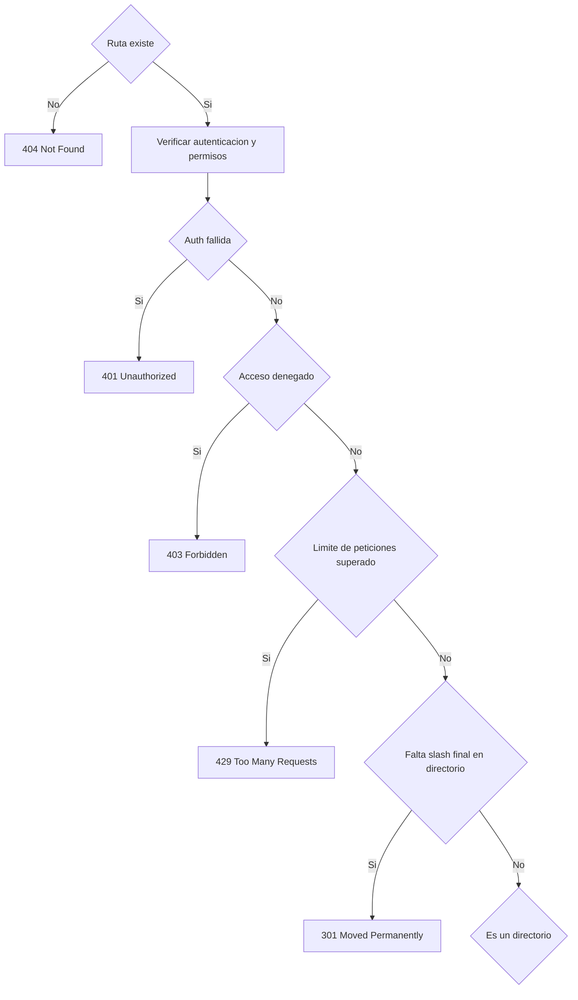

```mermaid
flowchart TD
    F{Ruta existe}
    F -- No --> E404[404 Not Found]
    F -- Si --> G[Verificar autenticacion y permisos]

    G --> H1{Auth fallida}
    H1 -- Si --> E401[401 Unauthorized]
    H1 -- No --> H2{Acceso denegado}
    H2 -- Si --> E403[403 Forbidden]
    H2 -- No --> H3{Limite de peticiones superado}
    H3 -- Si --> E429[429 Too Many Requests]
    H3 -- No --> I{Falta slash final en directorio}
    I -- Si --> E301[301 Moved Permanently]
    I -- No --> J{Es un directorio}
```
