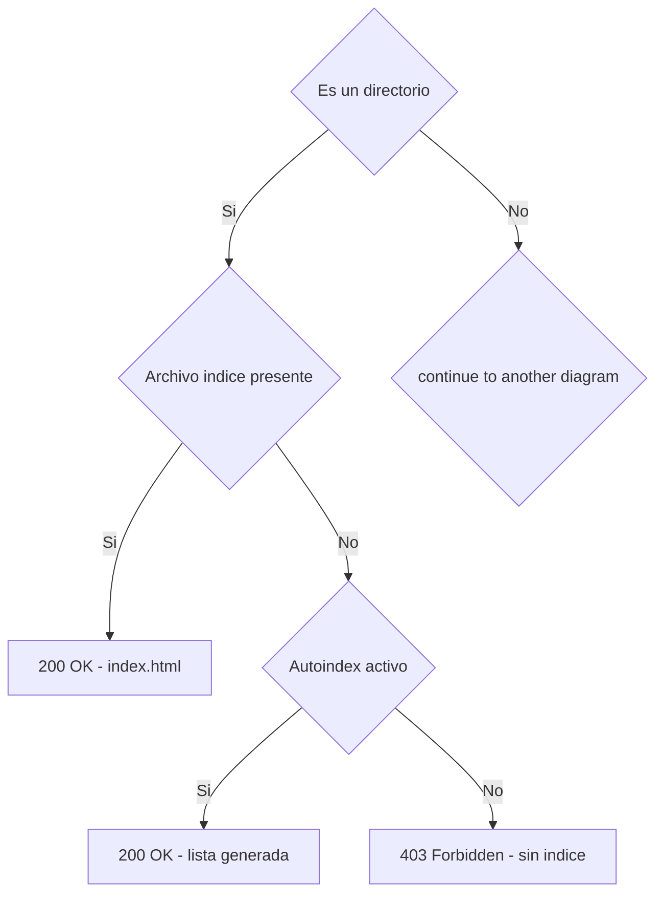

```mermaid
flowchart TD
    J{Es un directorio}
    J -- Si --> K{Archivo indice presente}
    K -- Si --> L[200 OK - index.html]
    K -- No --> M{Autoindex activo}
    M -- Si --> L2[200 OK - lista generada]
    M -- No --> E403b[403 Forbidden - sin indice]

    J -- No --> N{continue to another diagram}
```
