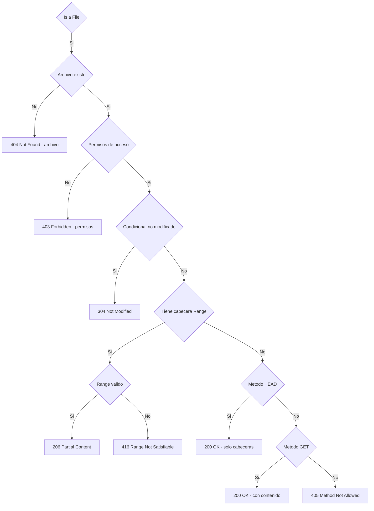

```mermaid
flowchart TD
    N{Is a File}
    N -- Si --> O{Archivo existe}
    O -- No --> E404b[404 Not Found - archivo]
    O -- Si --> P{Permisos de acceso}
    P -- No --> E403c[403 Forbidden - permisos]
    P -- Si --> Q{Condicional no modificado}
    Q -- Si --> E304[304 Not Modified]
    Q -- No --> R{Tiene cabecera Range}
    R -- Si --> R1{Range valido}
    R1 -- Si --> E206[206 Partial Content]
    R1 -- No --> E416[416 Range Not Satisfiable]
    R -- No --> S{Metodo HEAD}
    S -- Si --> E200h[200 OK - solo cabeceras]
    S -- No --> T{Metodo GET}
    T -- Si --> E200[200 OK - con contenido]
    T -- No --> E405[405 Method Not Allowed]
```
