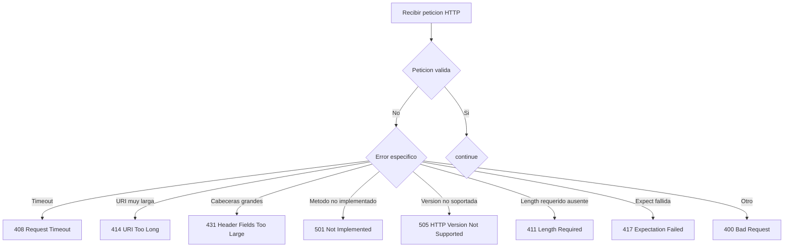

```mermaid
flowchart TD
    A[Recibir peticion HTTP] --> B{Peticion valida}
    B -- No --> B1{Error especifico}
    B1 -->|Timeout| E408[408 Request Timeout]
    B1 -->|URI muy larga| E414[414 URI Too Long]
    B1 -->|Cabeceras grandes| E431[431 Header Fields Too Large]
    B1 -->|Metodo no implementado| E501[501 Not Implemented]
    B1 -->|Version no soportada| E505[505 HTTP Version Not Supported]
    B1 -->|Length requerido ausente| E411[411 Length Required]
    B1 -->|Expect fallida| E417[417 Expectation Failed]
    B1 -->|Otro| E400[400 Bad Request]


    B -- Si --> C{continue}
```
