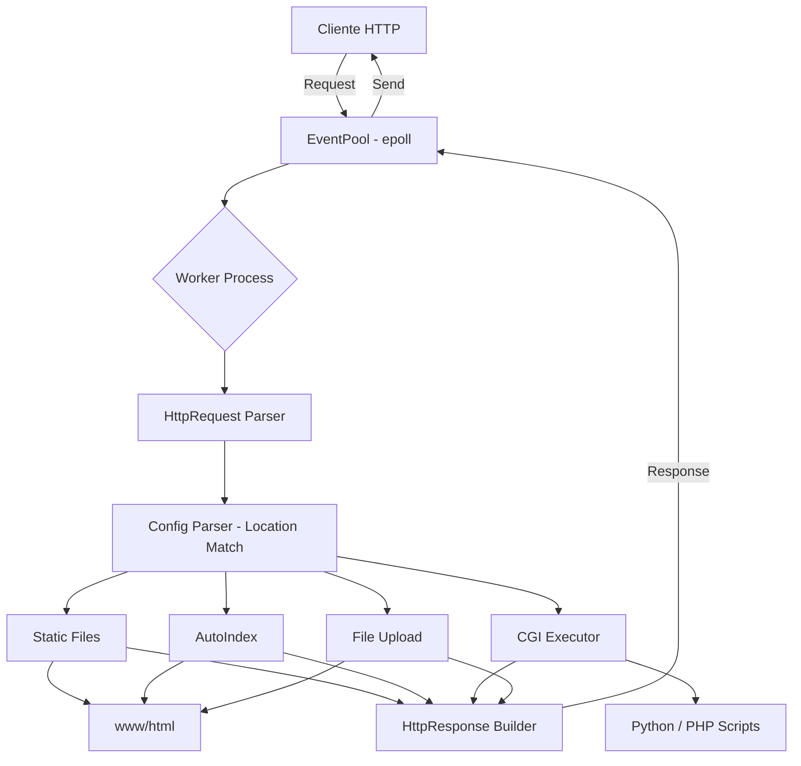

# Webserv


## 🎯 Descripción

Implementación desde cero de un servidor HTTP/1.1 en C++98 que soporta múltiples clientes concurrentes mediante un modelo de I/O asíncrono basado en `epoll`. El servidor interpreta configuraciones estilo NGINX, ejecuta scripts CGI (Python/PHP), gestiona uploads, redirecciones y auto-indexing de directorios.

Este proyecto representa un reto de sistemas de bajo nivel que exige dominio de sockets POSIX, multiplexación de I/O, parsing de protocolos y arquitectura de servidores reales.

## ✨ Características Principales

- **Servidor HTTP/1.1 completo**: GET, POST, DELETE, PUT, OPTIONS, HEAD
- **Event-driven I/O**: Multiplexación con `epoll` para manejar miles de conexiones simultáneas
- **Worker processes**: Arquitectura multi-proceso para aprovechar múltiples núcleos
- **CGI (Common Gateway Interface)**: Ejecución dinámica de scripts Python y PHP
- **Sistema de configuración declarativa**: Locations, rewrite rules, límites de body, páginas de error personalizadas
- **Auto-indexing**: Generación automática de listados de directorios estilo Apache
- **Virtual hosts**: Soporte para múltiples servidores en diferentes puertos
- **File upload**: Gestión completa de subida de archivos multipart
- **HTTP redirects**: Redirecciones 301/302 con configuración flexible

## 🛠️ Stack Tecnológico

| Categoría | Tecnología |
|-----------|------------|
| Lenguaje | C++98 |
| I/O Multiplexing | Linux `epoll` |
| Networking | BSD Sockets, POSIX API |
| Parsing | Custom HTTP lexer & parser |
| CGI | Python 3, PHP-CGI |
| Build System | Makefile |

## 🏗️ Decisiones Técnicas y Arquitectura

La arquitectura del servidor responde al desafío fundamental de manejar **I/O concurrente sin bloqueo** en C++98 (sin `std::thread` ni características modernas de C++11+). Se optó por `epoll` sobre `poll`/`select` por su escalabilidad O(1) en el número de descriptores, y un modelo de **worker processes** (fork) para paralelismo real, evitando el GIL que limitaría implementaciones similares en lenguajes interpretados.

El diseño modular separa claramente responsabilidades: `EventPool` gestiona el ciclo de eventos, `HttpRequest/HttpResponse` encapsulan el protocolo HTTP, `Server/Location` modelan la configuración declarativa, y `CGIExec` orquesta la ejecución de scripts externos mediante pipes y variables de entorno conforme al estándar RFC 3875.

El parser de configuración soporta una sintaxis personalizada que permite definir bloques anidados, herencia de configuraciones y validación en tiempo de inicio, similar a la filosofía de `nginx.conf`.

## 📊 Diagrama de Arquitectura



## 🚀 Guía de Instalación

### Prerrequisitos

- Compilador C++ compatible con C++98 (g++, clang++)
- Sistema operativo Linux (requiere `epoll`)
- Python 3 y/o PHP-CGI (para soporte CGI)

### Compilación y Ejecución

```bash
# Clonar el repositorio
git clone https://github.com/samuelhm/Webserv.git
cd Webserv

# Compilar el proyecto
make

# Ejecutar con archivo de configuración
./Web_Server config

# Ejecutar con Valgrind para depuración de memoria
make v

# Limpiar objetos de compilación
make fclean
```

### Configuración Rápida

El servidor utiliza un archivo de configuración personalizado:

```
server_name:defaultName
listen:localhost:8080
root:./www/html

location:/ {
    index:index.html
    allowed_methods:GET
}

location:/cgi-bin {
    allowed_methods:GET POST
    cgi_enable:on
    cgi_path:/usr/bin/python3
}
```

## 📁 Estructura del Proyecto

```
.
├── src/
│   ├── main.cpp              # Punto de entrada
│   ├── EventPool/            # Multiplexación I/O con epoll
│   ├── HTTP/                 # Parser y builder HTTP
│   ├── ConfigFile/           # Parser de configuración
│   └── Utils/                # Utilidades y logging
├── www/html/                 # Root del servidor web
├── config                    # Archivo de configuración
└── Makefile
```

## 👤 Contacto

**Samuel Hurtado Marín**

[](https://github.com/samuelhm/)
[](https://www.linkedin.com/in/shurtado-m/)

---

*Proyecto desarrollado como parte del currículo de 42 Barcelona, demostrando competencias en programación de sistemas, arquitectura de software y protocolos de red.*